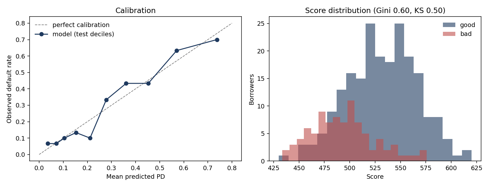

# Credit Risk Scorecard — PD Modelling and Fairness Audit

An end-to-end probability-of-default (PD) scorecard built the way retail credit models are built in banks: weight-of-evidence binning, information-value feature selection, a logistic regression on WoE features, validation of **both** discrimination and calibration, and points scaling into a scorecard.

It also asks a question the standard textbook treatment skips: **what does excluding protected characteristics actually do** — to accuracy, to proxies, and to who pays? — compared across two countries.



---

## Results

| Metric | Train | Test |
|---|---|---|
| AUC | 0.817 | 0.799 |
| Gini | 0.633 | **0.598** |
| KS | 0.498 | **0.503** |
| Mean predicted PD vs observed | — | 0.298 vs 0.300 |

A modest train/test gap and near-exact aggregate calibration. Scores run from roughly 430 to 620, with default rates falling monotonically from 67% in the lowest score quintile to 7% in the highest.

---

## Method

**1. Target and split.** Default = "bad" (1). A 70/30 split stratified on the target, so both halves keep the 30% default rate. Every binning and WoE calculation uses training data only; computing them on the full data would leak test information into the model.

**2. Weight of evidence and information value.** Numeric features are split into quantile bins; categoricals keep their levels. For each bin, WoE = ln(%goods / %bads) — positive means safer than average. Information value summarises each feature's overall power. Four features come out uninformative (IV < 0.02) and are dropped.

**3. Logistic regression on WoE.** Because WoE is already a log-odds, a single-feature model would have a coefficient of exactly −1; with WoE coding, every coefficient predicting default should be **negative**.

**4. Validation.** Discrimination (AUC, Gini, KS) measures whether the model *ranks* borrowers correctly. Calibration measures whether the PD *values* are right. They are independent — a model can rank perfectly and still be badly calibrated — and for IFRS 9 provisions and IRB capital it is the values that matter.

**5. Points scaling.** A score of 600 corresponds to 50:1 good:bad odds, and every 20 points doubles the odds (PDO = 20). Because the model is linear in WoE, the total score decomposes exactly into points per bin per feature (`outputs/scorecard.csv`). Converting scores back to PDs reproduces the model's PDs to within 10⁻¹⁵.

---

## Judgement calls

The parts that aren't mechanical — and the ones I'd want to discuss.

**Protected characteristics excluded.** `personal_status` encodes sex alongside marital status, and `foreign_worker` encodes nationality-related status. Using either in a UK credit decision would breach the Equality Act 2010, so both are excluded from the model — though, as below, they are then used to *audit* it.

**`checking_status` exceeds the "suspicious" IV threshold (0.63) — but isn't leakage.** An IV above 0.5 is a prompt to check for leakage: information unavailable at decision time. Checking-account status is known at application, so it's legitimate. But its direction is counterintuitive — applicants with *no* checking account default least. Two explanations: the variable mainly captures financial stress (overdrawn accounts default 48% of the time), and — more importantly — **this dataset contains only approved loans**. If the lender's historical policy was stricter towards applicants without an account, those who got through were unusually creditworthy on everything else. That's sample selection bias, the problem **reject inference** exists to address.

**`job` dropped for a sign flip.** Its coefficient came out *positive* (+0.37) — the model was using it against its own evidence. It has near-useless IV (0.024) and overlaps heavily with `employment`, so once `employment` is in the model, `job` is fitting residual noise: multicollinearity. A wrong-signed coefficient is indefensible in a regulated scorecard, so the script removes any such feature and refits automatically. Test Gini is unchanged (0.601 → 0.598).

**Bins are not merged for monotonicity.** Production scorecards merge adjacent bins so WoE moves monotonically (e.g. risk rising steadily with loan duration). That's partly regularisation — bins here hold ~50 borrowers, so the standard error on each WoE is around ±0.35, and small WoE differences are noise — and partly explainability. I've left quantile bins as-is to keep the pipeline automatic; merging would be the next refinement.

---

## Fairness audit

Train the same model with and without protected characteristics (100 cross-validated fits), test whether the remaining features can predict sex, and compare predicted against actual default rates by group. Run on German Credit and on a 30,000-borrower Taiwanese credit-card dataset.

| | Germany | Taiwan |
|---|---|---|
| AUC with protected characteristics | 0.785 | 0.724 |
| AUC without | 0.780 | 0.723 |
| **Accuracy cost of exclusion** | 0.005 | 0.001 |
| Proxy strength (predict sex from remaining features, AUC) | 0.69 | 0.58 |
| Actual default — women / men | 35.2% / 27.7% | 20.8% / 24.2% |
| Predicted default (model without sex) — women / men | 31.3% / 29.2% | 21.3% / 23.3% |

**Findings.**

- **Exclusion barely costs accuracy** — half a point of AUC in Germany, a tenth of a point in Taiwan.
- **The information doesn't disappear.** In Germany the remaining features predict sex with an AUC of 0.69 (redundant encoding), so simply deleting a column is not a complete answer to fairness.
- **Exclusion redistributes rather than degrades.** It pulls the two groups' predictions towards each other, creating a cross-subsidy. In Germany women default more, so exclusion favours women; in Taiwan women default less, so exclusion favours men. The mechanism is identical; the direction depends entirely on the underlying gap.
- **Richer behavioural data reduces the tension.** Taiwan has weaker proxies yet the model reproduces *more* of the sex gap (~59% vs ~28%). Its six months of repayment history explain much of why men default more — so the gap is attributed to what borrowers did rather than who they are.

---

## Limitations

- German Credit is a standard teaching dataset: 1,000 loans from 1970s Germany. The value here is in the method and the reasoning, not the numbers.
- No reject inference, so estimates are conditioned on the lender's historical approval policy.
- A single random split rather than out-of-time validation, which a production model would require.
- Calibration is checked on 30-borrower deciles, so individual bands carry roughly ±7 points of sampling noise.
- The Taiwan data covers credit cards during the 2005 card-debt crisis; neither dataset generalises neatly.

---

## Connection to regulatory credit risk

The model produces a PD — one of the three components of expected loss (**EL = PD × LGD × EAD**). Under **IFRS 9**, point-in-time PDs like these drive expected-credit-loss provisions, which is why calibration matters as much as ranking. Under **IRB**, through-the-cycle PDs feed the Vasicek capital formula, where the gap between the 99.9th-percentile conditional PD and the average PD sets capital against unexpected loss.

---

## Run

```bash
pip install -r requirements.txt
python credit_scorecard.py
```

Outputs are written to `outputs/`: the scorecard, information values, the fairness table and the validation plot.
